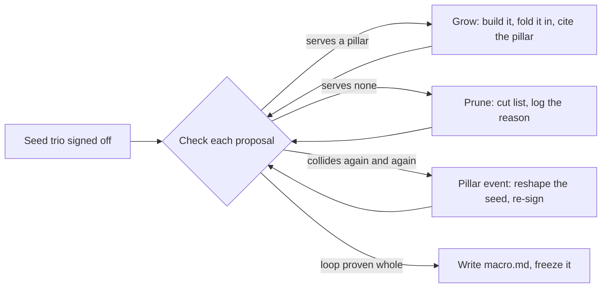

# Tending a Game Concept

A concept bundle is tended like a bonsai: the trunk stays, branches grow, and a branch that no longer fits is cut cleanly and the cut is recorded. Three motions cover everything: **check** before building, **grow** when knowledge arrives, **prune** when a branch stops serving the tree. Every motion ends in the bundle's `log.md`, because a decision that lives only in a conversation is lost to the team and gets relitigated forever.[^cook-design-logs] The bundle being tended is defined in [concept-bundle.md](concept-bundle.md); its birth is [seeding.md](seeding.md).

## Check: test work against the seed before building

Before a feature, asset direction, or tuning structure is built, run it against the seed:

1. **Which pillar does it serve?** Name the pillar in the decision, bracketed, the way Nisli ties every product decision to a numbered pillar.[^nisli-pillars] A proposal no pillar supports is feature creep by definition; reject it or reshape it until a pillar claims it. This filter is allowed to reject genre staples: id cut cover and reloading from DOOM because they violated push-forward combat.[^id-push-forward]
2. **Where does it land in the loop?** It must feed a layer of `loop.md`. A system whose output feeds no loop layer is a dead end regardless of how good it sounds.
3. **Does it survive the smell catalog?** Run the relevant smells from [the critique playbook](../design/critique.md): dominant strategy, no opportunity cost, treadmill, complexity over depth.

Three outcomes: proceed (log the decision with its pillar citation), reshape (log what changed and why), or reject (the branch goes to the cut list in `scope.md`, with the reason logged). If proposals keep colliding with the same pillar, stop treating the collisions as rejections and ask whether the pillar is wrong; that question is an event, below.

## Grow: fold knowledge in deliberately

Playtest results, decisions from working sessions, and answers to a stub's open questions land in `log.md` first as dated entries (what was tried, what it showed, what was decided, why), and are folded into the area files deliberately, not live during the conversation.[^cook-design-logs] The files stay short and current; the log absorbs the churn. A draft area whose open questions are answered graduates to `status: stable`. Follow OKF bookkeeping on every fold: refresh the file's `generated`, and if the fold materially changes something a human `verified`, drop that verification and ask for a new sign-off, because it vouched for text that no longer exists.

## Prune: cut with a reason, never silently

Pruning is the bonsai move: a mechanic, character, or system that was good in isolation gets removed because the tree grew a different way. The discipline:

- Remove it from the area file; do not leave dead branches inline.
- Park it in the cut list in `scope.md` with one line on what it was. A parked cut is reversible in principle, which makes cutting emotionally cheap enough to actually do, and a pre-existing cut list means scope crises are handled by consulting it, not by panic.[^cut-practice]
- Log the cut and its reason. The reason is the anti-relitigation record: reopening a logged cut requires new evidence (a playtest, a changed pillar), not lingering fondness.[^cook-design-logs]

## Events, not edits: changing the seed itself

`vision.md`, `pillars.md`, and `loop.md` are protected by their `verified` sign-off. Changing them is allowed, early pre-production exists precisely to rethink the seed several times, but it is an event with a ritual, never a casual edit: state what the change is, which logged evidence forced it, what it invalidates downstream (which decisions cited the old pillar), then rewrite, drop the old `verified`, obtain a fresh human sign-off, and log the event. Pre-production is the cheap time for this; the same change after the macro exists is expensive.[^cerny-method]

`macro.md` has the opposite lifecycle: absent until the loop has been proven whole in a prototype, then written short and frozen. After the freeze, micro detail flexes in production but the macro does not; Uncharted 2 shipped within five to ten percent of its macro.[^lemarchand-macro] A proposal that would break the frozen macro is by default rejected, and accepting it anyway is a project-level event, not a design tweak.

## Bookkeeping on every touch

Refresh `generated` on any meaningful change; append the dated `log.md` entry; refresh `index.md` if a description changed; keep `status` honest (`draft`, `stable`, `deprecated` for a kept-but-superseded area); run `okf-validate --strict` before committing.

[^cook-design-logs]: Cook, Lostgarden 2011. "Without centralized documents, you end up with a fragmented conversation where many decisions made in one-on-one conversations are lost to the broader team forever."
[^nisli-pillars]: Nisli, Design Pillars and Product Decisions. Every decision carries a bracketed pillar reference, giving traceability from philosophy to implementation.
[^id-push-forward]: Loudy and Campbell, GDC 2018. The push-forward pillars drove the rejection of cover, reloading, and regenerating health.
[^cerny-method]: Cerny, D.I.C.E. 2002. Pre-production is allowed to be chaotic; production is not. The macro is written at the boundary.
[^lemarchand-macro]: Lemarchand, GameSpot interview. The 70-row macro; 5 to 10 percent deviation at ship.
[^cut-practice]: Practice consolidated from scope-management writing: maintain the cut list before the crisis, prefer cutting content to consuming the polish buffer, park cuts where they can be found again.
